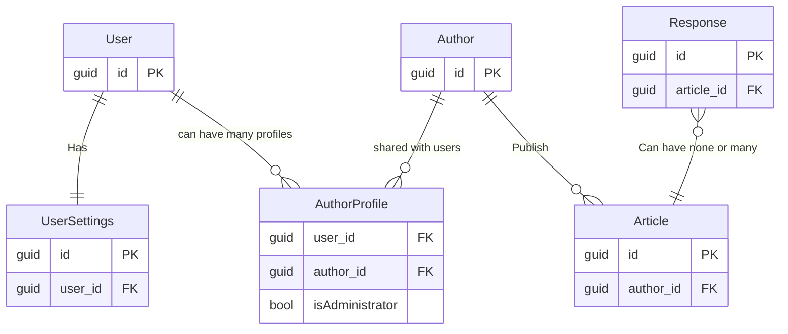

There's a lot of ground to cover in this course. Take a few minutes to acquint yourself with the domain and how data (classes) are related to each other.

Having at least a rough understanding of the domain classes and their relatons is important to make best use of the time and really understand how Object-Relational Mapping (OR/M) concepts and EntityFramework Core fit togehter.

## Entity Relationship (E/R) Diagram
In simple terms, a _user_ may have an _author profile_ that can write and publish _articles_. An _author profile_ may be shared among one or more users, but there must be at least one administrating user. Users can write _responses_ on published articles.

Take a moment to scan the ER diagram below, and look through the code in `./src/Domain`

## Solution Structure
Take a look at the overall solution structure and get an idea of how the different projects relate to one another.
- `Domain`: this project contains the domain classes - that is classes that model data and contain business rules about how to interact with the data/models.
- `Persistence`: All the code concerned with persistence infrastructure. Database configuration and interactions happen here. You'll typically not have any `public` classes in such a project.
- `Exercises`: A unit test project that you can use to prototype ideas and iterate fast. This project also contains some exercises for you to go through.