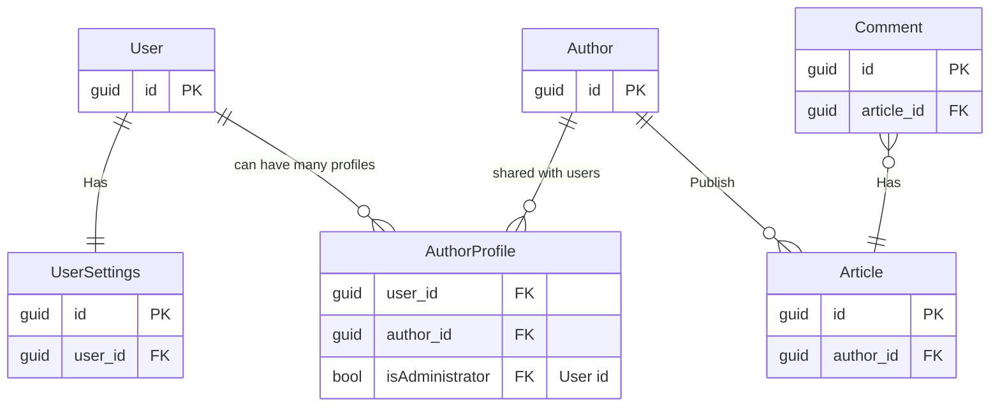

# Project description

This project simulates a blogging database.  
We'll work with classes such as User, Author, Article, Comments.

## Prerequisites

- .NET 7 SDK
- install dotnet-ef, dotnet-user-secrets

## Outline

- Introduction to EntityFramework Core and the benefits it brings
- Query Examples
- Key Concepts and setup
    - DbContext
    - IEntityTypeConfiguration
    - Converters
    - Constraints, primary and foreign key, CHECK
    - Indexes
    - Joins, 1-to-1, 1-to-many, many-to-many (join table)
- Models
    - Attributes
- Code First database management
- Separating infrastructure from business logic
- Soft delete
  - Global filter for type
- Storing secrets such as the connection string
- Repositories
  - Partial hydration
  - Auto include
- Adding data on migrate (separate migrations)
- Testing with an actual database

## Domain overview

In simple terms, an author profile may be shared among many users but must always be administered by one. An author
writes and publishes articles. Users may comment on published articles.

### Article

State diagram showing how an article can switch state.

## Notes

- Neglecting database knowledge and techniques is a mistake. To use any ORM effectively, you need to know the underlying
  technology intimately.
- Removing persistence logic from entities
- Generating primary keys: GUID vs Long, Application vs Database generated
- Model attributes inconvenient conveniences

## Exercise

Generate migration from unconfigured classes. Inspect the proposed changes from EF Core. Tweak the configuration.
Run generate SQL script.

## Links

- https://www.dataversity.net/a-short-history-of-the-er-diagram-and-information-modeling/#
- https://creately.com/guides/er-diagrams-tutorial/
- https://vertabelo.com/blog/vertabelo-tips-good-er-diagram-layout/
- https://learn.microsoft.com/en-us/ef/core/modeling/generated-properties?tabs=fluent-api